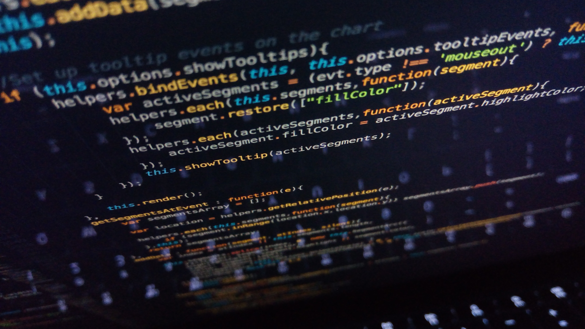

# ***New Coder Hard At Work***
>### **Code under Construction?** *Let's start off discussing the tools you'll need.*

One of the first (and most important) tools you will need if you plan on being a competent coder is the *Text Editor*. This is the software you use to manage the text of your code. There are some things to consider when comparing different software, but the decision seems to boil down to personal preference. One of the things I enjoy about text editors is that they remind me to close my brackets. This functionality is called code completion and it is standard (and a lifesaver) on most text editors. If you find one without, it's probably worth moving along to an option like Visual Studio Code.

Some of the other important functions you should want in your text editor are:
- *Syntax Highlighting* color codes your text to assist in writing and debugging code.
- Different color *Theme* options to reduce the strain on the coder's eyes.
- *Extensions* can open up new coding languages as well as help transition your code between Web Browsers or Operating Systems (if you're working on applications).
- Creates and organizes files, folders, and extensions for your product. (Larger projects can create a mess of different storages for different assets, )

(Photo by Irvan Smith on Unsplash)

If you're not wanting to find a text editor online, it is possible to achieve the same product using an application like word or notebad. You lose many of the functions and "safety-nets" listed above, but it is doable. Simply ensure you are coding in plain text. This is a setting that removes formatting options for the text such as bold or italics etc., These options can negatively impact the code you are trying to write and it is important to have them off. 

