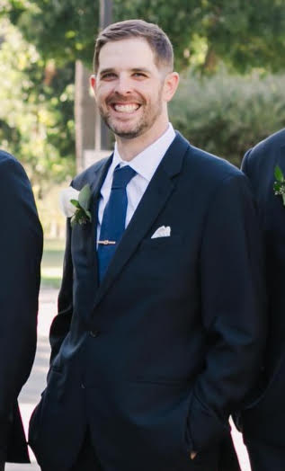

# ***John Rayome*** 

[https://github.com/JRay87](https://github.com/JRay87)

Hello everyone! My name is John. I am a student with the Code Fellows program with minimal prior experience with software development. I was in the Air Force for six-years prior to graduating from College. I am excited for this opportunity with Code Fellows but would be lying if I didn't admit being anxious about this pivot. Below I will keep notes from all my classes. If you are new to Software Development I hope that you find this information valuable.

## *Table of Contents*

Click [here](GrowthMindset.md) to get yourself into the learning mindset.

Click [here](Mrkdwnnotes.md) to see what I've learned about Markdown and how it can shape the sites we use.

Click [here](CodersComp.md) to read about the most important tools in the coder's arsenal.

Click [here](GitRepositories.md) to learn some info on Git, Repositories, and how they work.

Click [here](Basicsofhtml.md) to for information on HTML.